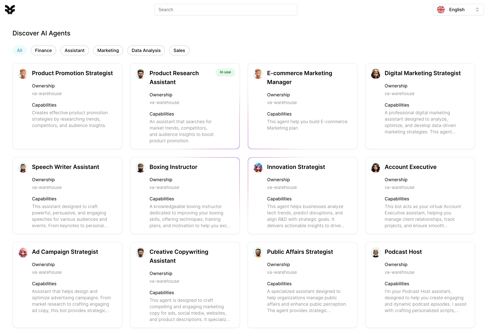

# AI Agent Builder Platform

## Overview
The IGOTAI Agent Builder Platform provides a comprehensive suite of tools and frameworks for creating, testing, and deploying AI agents. It combines no-code interfaces with advanced AI capabilities to enable both developers and non-developers to create AI agents with their clicks in seconds.

The iGOT AI platform introduces a cutting-edge decentralized agent network that combines the power of **semi-decentralized LLM Cluster** with **decentralized Small Language Models (SLMs)**. This hybrid approach provides an efficient, scalable, and cost-effective way to tackle diverse AI tasks, particularly in the context of crypto trading, DeFi, and other high-demand decentralized ecosystems.

### Problem Space
1. Limited Access to AI Tools: Many experts in various fields lack access to advanced AI tools and platforms that can help them monetize their knowledge. This is often due to high costs, technical barriers, or centralized control over AI resources.
2. Centralized Infrastructure: Traditional AI platforms rely heavily on centralized infrastructure, which can be costly and inefficient. This limits scalability and accessibility, particularly for small businesses and individual experts.
Underutilization of Expertise: Experts in niche domains often find it challenging to translate their knowledge into AI models or applications that can be monetized. This is due to a lack of platforms that support easy integration of domain-specific knowledge into AI systems.
Data Privacy Concerns: Centralized systems often require users to relinquish control over their data, leading to privacy concerns and reluctance to adopt AI solutions.
3. LLMs require significant computational resources, which are typically centralized in large data centers. This centralization is due to the need for high processing power and memory, making it difficult to distribute LLMs across decentralized networks.
4. Cost: Running LLMs is expensive due to their resource demands. This cost is often prohibitive for small businesses and individual users, limiting accessibility and scalability in a decentralized context.
5. Data Privacy: Centralized LLMs often require users to upload data to a central server, raising privacy concerns. In a decentralized world, data sovereignty is crucial, and users prefer to keep data local.
6. Isolated Agents: Current AI platforms are designed for isolated agents, where each agent is designed to perform a specific task. This lack of collaboration and data exchange between agents limits the overall intelligence of the network.

### Future Infrastructure Capabilities
Decentralized Networks: The rise of decentralized networks, such as blockchain and edge computing, offers a new paradigm for AI infrastructure. These networks can provide scalable, cost-effective, and secure platforms for deploying AI solutions.
Edge Computing: By leveraging edge computing, AI tasks can be processed closer to the data source, reducing latency and costs. This allows for more efficient use of resources and enables real-time AI applications.
1. No-Code Platforms: The development of no-code platform democratizes AI development, allowing non-technical users to create and deploy AI solutions. This empowers experts to focus on their domain knowledge rather than technical implementation.
2. Collaborative AI Agents: Future AI systems will likely support collaborative models where multiple agents work together, sharing insights and data. This can enhance the accuracy and utility of AI applications, making them more valuable to end-users.

---
### **Key Concepts**

#### 1. **Agent Classification**
Agents on the iGOT AI platform are divided into two categories:

**a. Complex Agents**  
- Designed for tasks involving **high volatility of information** and **unpredictable contexts**.
- Powered by **large language models (LLMs)** hosted by centralized LLM-providers.
- Handle tasks requiring advanced reasoning, natural language understanding, and complex decision-making.  
- Example Use Cases:  
  - Interpreting breaking news in crypto markets.  
  - Generating market sentiment analysis from diverse, real-time data sources.

**b. Specialized Lightweight Models (SLMs)**  
- Decentralized, task-specific models optimized for **small but highly valuable tasks**.
- Fine-tuned for **narrow domains** with well-defined objectives.
- Deployed at the edge to reduce costs and **maximize scalability**.  
- Example Use Cases:  
  - Monitoring social media sentiment for a specific crypto asset.  
  - Tracking KOL (Key Opinion Leader) wallet movements.  
  - Analyzing time-series data of crypto trading pairs.  

### **Key Features of Decentralized SLMs**
SLMs are at the core of the decentralized agent architecture, offering the following advantages:

- **Cost Efficiency**: By decentralizing small models at the edge, users avoid the high cost of running complex LLMs for simple tasks.
- **Scalability**: SLMs can be deployed across a distributed network, processing data locally and sharing insights globally.
- **Task Optimization**: Each SLM is fine-tuned for a specific task, ensuring high performance with minimal computational overhead.
- **Collaboration**: SLMs can exchange data and insights with other agents, creating a **network effect** to maximize processing power and context understanding.

### **Agent Collaboration and Data Exchange**

To enhance the power of decentralized agents, the iGOT NETWORK supports **agent-to-agent(a2a) collaboration** and **data exchange**. This functionality expands the network's capabilities beyond isolated tasks, enabling agents to collectively solve more complex problems.

#### a. **Data Ownership and Management**
- Each agent manages its own data locally, ensuring privacy and autonomy. This decentralization of data management reduces the risk of data breaches and enhances user trust.
- Data is stored in a **distributed ledger** or **secure local stores** for verifiability and accessibility, ensuring that data integrity is maintained across the network.

#### b. **Inter-Agent Communication**
- Agents communicate using **standardized protocols** to share correlated insights and coordinate tasks. This standardization ensures seamless interaction between agents, regardless of their origin or function.
- Examples of shared data:  
  - Correlations between time-series data for different crypto pairs.  
  - Market sentiment signals from different regions or platforms.  
  - Real-time network activity metrics (e.g., wallet movements, gas fees).

#### c. **Decentralized Context Processing**
- By sharing processed context data (e.g., consolidated insights from multiple agents), the network provides richer and more accurate information for decision-making. For example, sharing the same time-series data for different crypto pairs while each agent is monitoring different pairs and maintaining their own local data. This allows the agents to increase the accuracy of their analysis by leveraging the collective intelligence of the network and eliminate the hallucination of the LLM.
- This reduces the need for centralized LLM processing in cases where contextual data can be pieced together by SLMs.

### **Technical Architecture**

#### 1. **Hybrid Agent Framework**
We released private-alpha version on 01-01-2025 and plan public-alpha version on 16-02-2025.
- **No-Code Interface**:  
  - Drag-and-drop components
  - Visual programming environment
  - Template customization
  - Version control system
  - Domain-specific Language Agent(DSL-Agent)
- **Complex Agents**:  
  - Hosted on semi-decentralized clouds to leverage the power of LLMs.  
  - Provide high-level processing and reasoning for tasks requiring global context.  
  - Example: Interpreting breaking news or synthesizing large datasets. Data is increased over time then local agents can utilize our RAG locally with Pagerank algorithm to find signal of the market.

- **SLMs**:  
  - Decentralized and deployed on lightweight edge devices.
  - Efficiently handle repetitive, small-scale tasks with high precision.
  - Designed to work autonomously or collaboratively with other agents.

#### 2. **Decentralized Data Exchange Protocol**
- Uses blockchain or decentralized storage (e.g., IPFS, Filecoin) for secure and transparent data exchange.
- Ensures data provenance and integrity for collaborative tasks.

#### 3. **Incentive Mechanism for Collaboration**
- Agents that share valuable insights or resources are rewarded using a **tokenized incentive system**.
- Example: An SLM that identifies a critical trading signal and shares it with other agents is rewarded with tokens proportional to the signal's utility.

#### 4. **Federated Learning for SLMs**
- SLMs participate in **federated learning** to improve their models without sharing raw data.
- Updates are aggregated and distributed across the network, enabling decentralized model improvements.

### **Implementation in Crypto Trading**

#### 1. **SLMs for Crypto-Specific Tasks**
- **Social Media Monitoring**:  
  - Analyze trends and sentiment related to specific tokens on Twitter, Reddit, and Discord.  
  - Identify spikes in activity that correlate with price movements.

- **KOL Wallet Tracking**:  
  - Monitor transactions from influential wallets.  
  - Detect patterns and signals indicating possible market movements.

- **Pair-Specific Analysis**:  
  - Track time-series data for specific crypto pairs.  
  - Identify correlations, anomalies, and trading opportunities.

#### 2. **Collaborative Use Case**
- An SLM monitoring **social media sentiment for Bitcoin** shares its findings with another SLM analyzing **Ethereum market data**.  
- Together, they identify a short-term correlation between Bitcoin sentiment spikes and Ethereum price movements, enabling more informed trading strategies.

### **Advantages of the Decentralized Agent Network**

1. **Cost-Effective Scaling**:  
   - Decentralized SLMs reduce reliance on expensive centralized LLM services, enabling cost-efficient scaling for small tasks.

2. **Enhanced Privacy and Security**:  
   - Data remains locally managed by agents, reducing risks associated with centralized data storage.

3. **Resilience and Redundancy**:  
   - Decentralized architecture ensures the network remains robust even if individual agents fail.

4. **Maximized Resource Utilization**:  
   - By focusing on small, well-defined tasks, SLMs optimize computational resources and improve task efficiency.

5. **Network Effect**:  
   - Collaboration and data exchange between agents amplify the collective intelligence of the network.

### **Future Opportunities**

1. **Expansion to Other Domains**:  
   - Beyond crypto trading, SLMs can be deployed in areas like supply chain monitoring, IoT device management, and decentralized finance analytics.

2. **Marketplace for Agent Models**:  
   - A decentralized marketplace where developers can share, sell, or license fine-tuned SLMs for specific tasks.

3. **Integration with Complex Agents**:  
   - Complex Agents can act as coordinators, aggregating insights from SLMs to generate high-level analysis.

By combining the power of centralized Complex Agents and decentralized SLMs, the iGOT AI platform creates a robust, scalable, and cost-effective ecosystem for building and deploying AI agents in decentralized environments. This hybrid approach ensures that users can harness the best of both worlds: the intelligence of LLMs and the efficiency of task-specific SLMs.

---
## Role Model:

## **Community Roles and Circular Economy in iGOT AI Platform**

The iGOT AI platform operates within a **blockchain-powered circular economy** where three key roles—**Builders**, **Explorers**, and **Farmers**—interact symbiotically. Each role contributes to the ecosystem's health, ensuring incentives and value flow sustainably across the network.

---

### **1. Builder**
**Builders** are the innovators and creators of the iGOT AI ecosystem. They develop AI agents, fine-tune specialized lightweight models (SLMs), and monetize their work on the marketplace.

#### **Responsibilities**
- **AI-Agent Development**: Builders design, train, and fine-tune AI agents for specific tasks.
  - Example: Building an agent for crypto trading signals, monitoring KOL wallets, or analyzing NFT market trends.
- **Marketplace Monetization**: Publish AI agents on the marketplace, allowing Explorers to rent or license the agents for specific use cases.
- **Customization Services**: Build tailored AI agents for specific user requests.
- **Continuous Improvement**: Regularly update and improve AI agents based on user feedback and changing market trends.

#### **Earning Model**
- **Agent Licensing**: Earn from renting AI agents on a subscription or pay-per-use basis.
- **Revenue Sharing**: Builders earn a percentage of the revenue generated by their agents when they are executed on the decentralized network.
- **Token Incentives**: Builders are rewarded with platform tokens for creating high-demand or high-performing agents.

#### **Circular Economy PoV**
- Builders supply the ecosystem with innovative AI agents that power the decentralized digital economy.
- By monetizing their creations, they incentivize platform growth and drive demand for Farmers' edge computing resources.

---

### **2. Explorer**
**Explorers** are the consumers of AI agents. They utilize/rent AI agents through the marketplace to accomplish specific goals or automate tasks within the decentralized AI ecosystem.

#### **Responsibilities**
- **Renting AI Agents**: Rent or subscribe to AI agents for specific, task-oriented requirements.
  - Example: Renting a social media monitoring agent to track crypto sentiment or an NFT marketplace scraper to identify undervalued assets.
- **Data Ownership**: Upload their own data or provide task-specific parameters for the AI agents to process while retaining full ownership of their data.
- **Feedback and Ratings**: Provide feedback to Builders about the performance of AI agents, contributing to the ecosystem's quality improvement.

#### **Consumption Model**
- **Pay-Per-Use**: Pay only for the computational resources and time consumed by the AI agents.
- **Subscription-Based**: Fixed payment to rent an agent over a predefined period.
- **Freemium**: Access free versions of AI agents with limited features, with payment required for advanced capabilities.

#### **Circular Economy PoV**
- Explorers create demand for Builders' AI agents and Farmers' edge computing power, driving the ecosystem's economic engine.
- Their payments are distributed across Builders (for the agents) and Farmers (for the infrastructure), ensuring equitable value flow.

---

### **3. Farmer**
**Farmers** are infrastructure providers who invest in edge computing devices to power the decentralized AI ecosystem. They provide the computational resources required to run AI agents.

#### **Responsibilities**
- **Edge Device Setup**: Farmers set up and maintain edge computing devices that process AI workloads.
  - Example: Deploying GPUs, TPUs, or ASICs optimized for running SLMs efficiently.
- **Resource Allocation**: Allocate computing resources to AI agents based on marketplace demand.
- **Network Participation**: Contribute to the decentralized network's resilience and scalability by hosting distributed nodes.

#### **Earning Model**
- **Compute Rewards**: Farmers earn platform tokens for every AI agent task executed on their devices.
  - Rewards are proportional to the computational resources provided and the complexity of the task.
- **Profit Sharing**: Farmers earn a share of the revenue generated by Builders' AI agents that utilize their infrastructure.
- **Incentive Bonuses**: Additional rewards for maintaining high uptime, energy-efficient devices, or contributing to critical tasks during peak demand.

#### **Benefits to the Circular Economy**
- Farmers provide the decentralized infrastructure necessary for running AI agents, reducing dependence on centralized cloud services.
- Their contributions enable cost-efficient scaling of the platform, benefiting both Builders (lower deployment costs) and Explorers (lower usage costs).

---

### **Circular Economy Model**

The iGOT AI platform operates as a **self-sustaining circular economy**, where value is continuously recycled among Builders, Explorers, and Farmers. Here's how the model works:

#### **Value Flow**
1. **Builders** create AI agents and publish them on the marketplace for Explorers to rent.
2. **Explorers** pay for AI agent usage, generating revenue for Builders and Farmers (who provide the compute power to run the agents).
3. **Farmers** earn rewards for providing computational resources, which they can reinvest in upgrading their devices or purchasing/renting AI agents from Builders.
4. **Platform Tokens** circulate within the ecosystem, incentivizing all participants while enabling transactions (e.g., tokenized payments for agents, compute power, and rewards).

#### **Key Principles**
- **Resource Optimization**: Farmers' edge devices maximize resource utilization by running task-specific SLMs, reducing energy waste.
- **Incentive Alignment**: Builders, Explorers, and Farmers are incentivized to collaborate and innovate, ensuring a thriving ecosystem.
- **Data Sovereignty**: Explorers retain ownership of their data while benefiting from AI agent processing, ensuring privacy and trust.
- **Decentralization**: Farmers' edge devices power the network, ensuring scalability, resilience, and reduced reliance on centralized infrastructure.

---

### **Tokenomics**

The platform's token plays a central role in the circular economy, facilitating transactions, rewards, and governance.
We will public the detail tokenomics on the public-alpha version.

#### **Token Utility**
1. **Payment Medium**: Used by Explorers to rent AI agents or pay for computational resources.
2. **Rewards**: Distributed to Builders (for agent use) and Farmers (for compute contributions).
3. **Incentive Mechanisms**: Encourage high-quality agent development, efficient resource usage, and network participation.
4. **Staking and Governance**: Token holders can stake tokens to participate in platform governance, influencing future development and policy decisions.

#### **Revenue Distribution**
- A percentage of Explorer payments is allocated to:
  - Builders: For AI agent creation and innovation.
  - Farmers: For providing the computational power.
  - Platform Treasury: To fund ecosystem development and community initiatives.

---

### **Synergies Between Roles**

The three roles are interdependent, creating a feedback loop that sustains the ecosystem:

1. **Explorers drive demand**, incentivizing Builders to create specialized AI agents and Farmers to provide scalable infrastructure.
2. **Builders innovate**, attracting more Explorers to the platform and creating opportunities for Farmers to monetize their devices.
3. **Farmers expand infrastructure**, enabling Builders to deploy more complex agents and Explorers to access affordable AI services.

---

### **Future Vision: Fully AI-Driven Digital World**

In the long term, the iGOT AI platform will enable a fully decentralized AI-driven digital world where:

1. **Builders** function as the architects of an AI economy, deploying increasingly advanced agents across industries (e.g., trading, IoT, healthcare).
2. **Explorers** automate their workflows using AI agents, enhancing productivity and unlocking new opportunities.
3. **Farmers** power the decentralized AI backbone, creating a resilient and scalable infrastructure for the digital economy.

### 1. Development Interface
- Visual programming environment
- Drag-and-drop components
- Code editor integration
- Template customization
- Version control system

### 2. Advanced Agent Architecture

#### Knowledge Graph Integration
- Ontology management
- Relationship mapping
- Dynamic knowledge updates
- Query optimization
- Semantic reasoning

#### RAG (Retrieval Augmented Generation)
- Document indexing
- Context retrieval
- Response generation
- Source attribution
- Accuracy verification

#### Vector Database Support
- Embedding storage
- Similarity search
- Clustering capabilities
- Index management
- Cache optimization

#### Multi-modal Processing
- Text processing
- Image analysis
- Audio processing
- Video handling
- Sensor data integration

#### Agent Memory Management
- Short-term memory
- Long-term storage
- Memory consolidation
- Context preservation
- State management

#### Inter-agent Communication
- Protocol standards
- Message routing
- State synchronization
- Resource negotiation
- Error handling

### 3. Testing and Validation
- Unit testing framework
- Integration testing
- Performance benchmarking
- Security validation
- Compliance checking

### 4. Deployment Tools
- One-click deployment
- Environment management
- Resource allocation
- Monitoring setup
- Rollback capabilities

## Technical Specifications

### Agent Templates
1. Trading Agents
   - Market analysis
   - Strategy execution
   - Risk management
   - Portfolio optimization

2. DeFi Agents
   - Yield farming
   - Liquidity provision
   - Risk assessment
   - Protocol interaction

3. Social Media Agents
   - Content management
   - Engagement automation
   - Analytics
   - Trend analysis

4. Gaming Agents
   - NPC behavior
   - Game mechanics
   - Player assistance
   - Content generation
